Harap cantumkan nama pembuat untuk menghargai.
Jangan lupa tag ig : @bofoiii._
Instagram : https://instagram.com/bofoiii._
Facebook : https://www.facebook.com/profile.php?id=100074494745358

SILAHKAN BACA DOKUMENTASI DAN LAPORAN PADA FOLDER LAPORAN UNTUK MELIHAT DETAIL
!! MAAF JIKA LAPORAN TIDAK LENGKAP KARENA DIBATASI STOCK KERTAS

DOKUMENTASI PENGGUNAAN APLIKASI SEBAGAI MASYARAKAT

1.  Pengguna terlebih dahulu di hatuskan untuk membuat akun melalui url
    "/register" dan masuk melaui url "/login" untuk melakukan penawaran,
    tatapi pengguna juga bias hanya melihat jenis barang tanpa perlu
    melakukan login

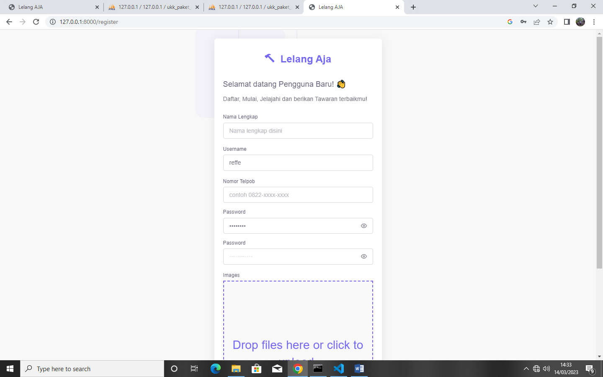

> 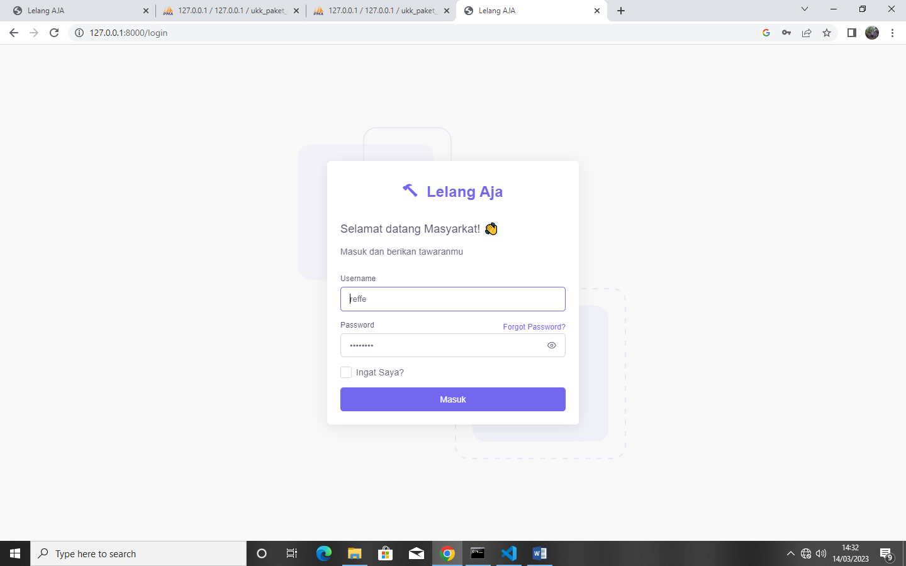

2.  Pengguna dapat mengunjungi halaman beranda untuk melihat barang apa
    saja yang dilelang pada url "/" kemudian pengguna dapat mengklik
    tombol tawar yang tersedia bila sudah menemukan barang yang
    diinginkan

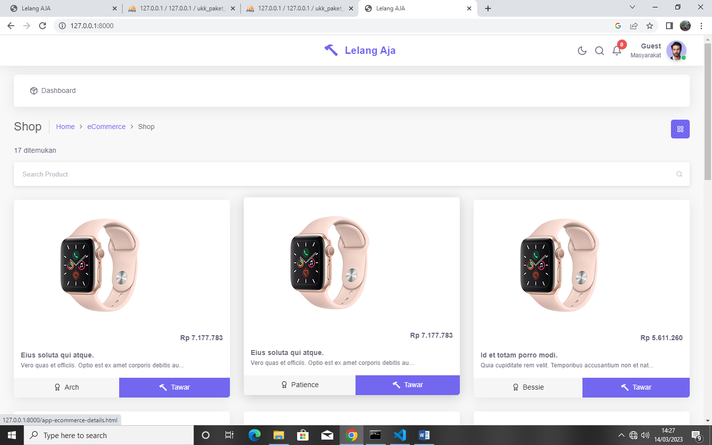

3.  Pengguna dapat memberikan penawaran dengan mengklik tombol tawar
    paga seksi lelang, pastikan jumlah tawaran lebih besar dariapa bit
    awal

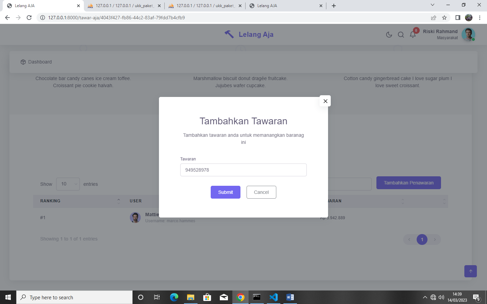

4 Pengguna akan mendapatkan notifikasi pada kolom notifikasi ketika
lelang telah di tutup

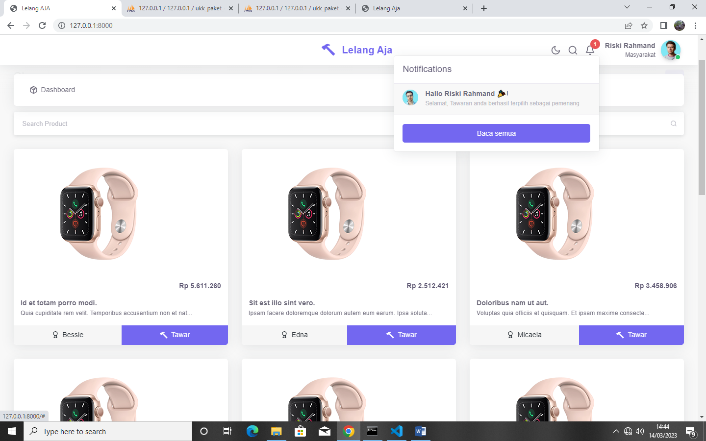.

DOKUMENTASI PENGGUNAAN SEBAGAI ADMIN

1.  Pastikan anda memiliki akun petugas ataupun admin, jika tidak
    memiliki, minta kepada admin untuk membautkan akun yang baru, jika
    sudah silahkan masuk menggunakan akun tersebut pada url "/cms/login"

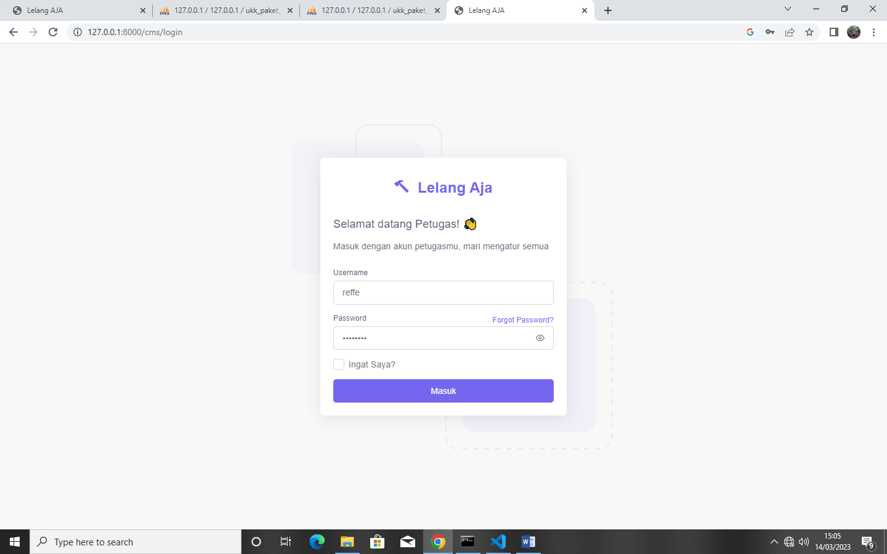

2.  Tambahkan stock barang yang akan dilelang

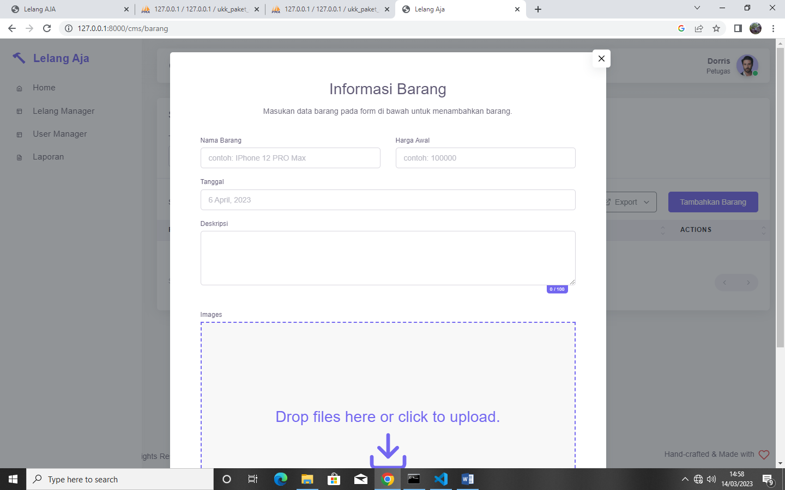

3.  Kemudian, buka lelang untuk barang tersebut melalui url
    "/cms/lelang"

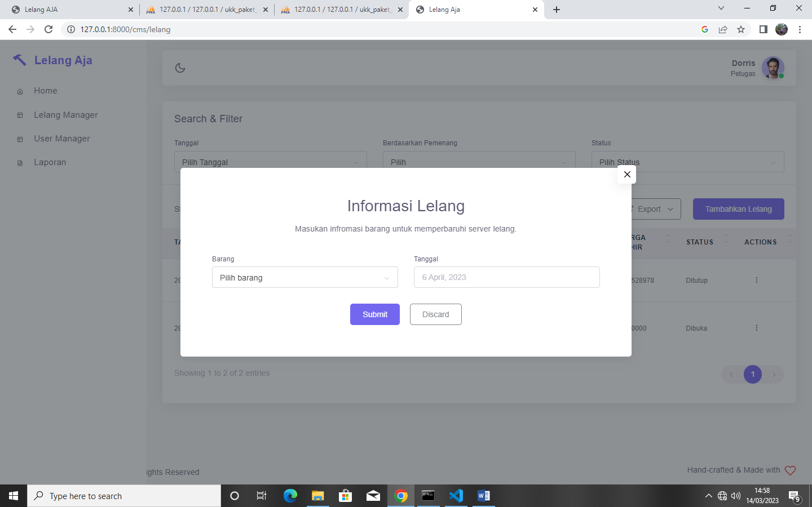

4.  Setelah anda merasa sudah waktunya menentukan pemenan, silahkan
    tutup lelang tersebut, pemenang akan dicari secara otomatis ketika
    lealng ditutup

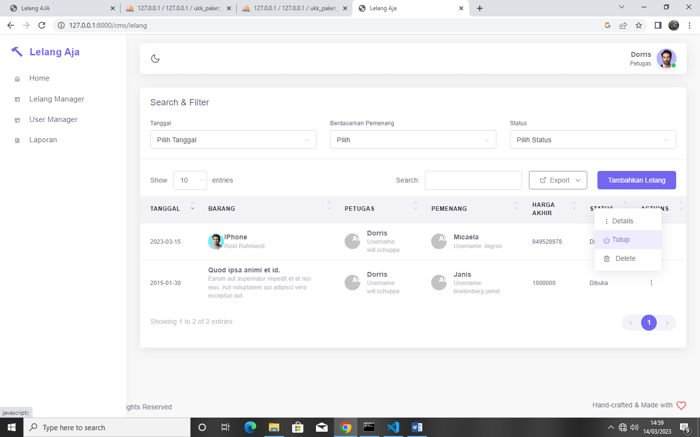

5.  Lihat semua hasil laporan lelang yang telah dilakukan pada url
    "/cms/laporan", anda juga dapat mengunduh file dengan banyak format
    atau melakukan printout

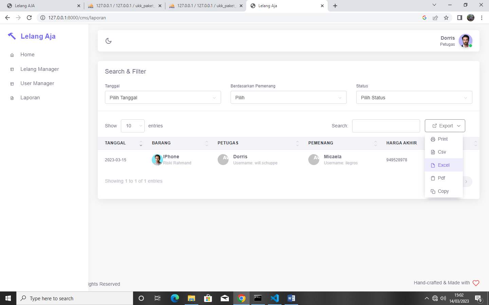

6.  Anda juga bias menambahkan petugas/admin baru

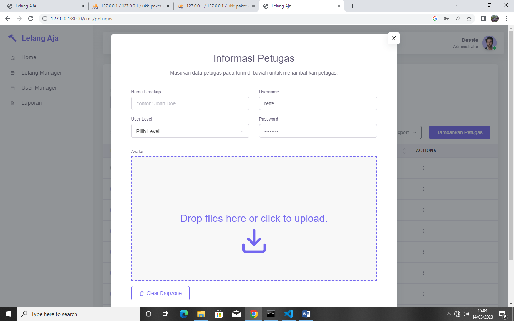{width="5.544444444444444in"
height="3.0631944444444446in"}
